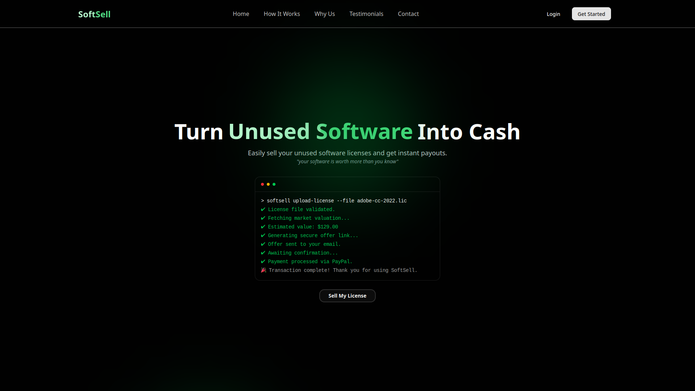
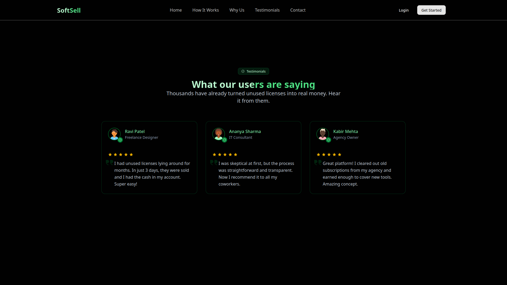

# 🧾 SoftSell – Software License Resale Platform (Frontend)

SoftSell is a fictional, single-page marketing website for a software resale startup. The goal of this project is to showcase a clean, responsive, and user-friendly frontend built with modern web technologies.

## 🔗 Live Site
[Visit Live Site](https://softsell-flax.vercel.app)

---

## ✨ Features Implemented

### ✅ Core Sections
- **Hero Section** : Headline, subheading, and CTA button
- **How It Works**: 3-step process (Upload → Valuation → Payout)
- **Why Choose Us**: Key benefits in icon tiles
- **Testimonials**: Customer reviews with role and company
- **Contact Form**:
  - Name, Email, Company, License Type (dropdown), Message
  - Frontend validation included

### 🎨 UI/UX
- Modern and clean design
- Responsive on all screen sizes (mobile, tablet, desktop)
- Tailwind CSS for styling
- Coherent color palette and typography

### 🔧 Tech Stack
- **Framework**: React
- **Styling**: Tailwind CSS
- **Animations**: Framer Motion
- **Icons**: Lucide
- **Form Handling**: Zod + React Hook Form

---

## 🌟 Bonus Features
- ✅ **Favicon and Logo Placeholder**
- ✅ **SEO Meta Tags** and Page Title
- ✅ **Light/Dark Mode Toggle**
- ✅ **Framer Motion Animations**
- ✅ **Mocked AI Chatbot** (Basic support-style assistant using hardcoded logic)

---

---

## 🧠 Design Choices
- **Typography**: `Inter` for a clean, modern look
- **Palette**: Light green + white with dark mode support
- **Layout**: Mobile-first approach using Tailwind's grid and flex utilities
- **Chatbot UX**: Mimics LLM chat UI with clear prompt handling

## 📦 Deployment
- Hosted on **Vercel**
- Optimized for performance and SEO

---

## 🤝 License
This project is licensed under the MIT License - see the [LICENSE](LICENSE) file for details.
---

